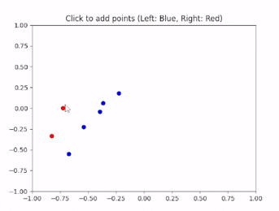

# AI 4 - Advanced
AI 4 is the advanced level of our AI Development Courses, building off of what students learned in the Intermediate AI 3 class they will learn to build their own neural network based AI models using the python programming language and PyTorch one of several tools used in creating and training modern AI, in order to create several small projects each with their own small AI model. 

AI 4 focuses on giving students a strong understanding of some of the additional systems and ideas that laid the groundwork for modern AI models, from the theory of how text transformers and images diffusers works, to exploring different variations of how we can build neural network to better interpret different types of data, as well as learning about and experimenting with different methods for training AI models. 

A student who succeeds in AI 4 will have a solid understanding of many the underlying ideas modern AI are expanded from and will be well on their way to learning how to eventually work on modern AI models. 

## Learning Goals
Learning goals should be understood by the student at the end of the classes

### General Code Skills
* Variables And Data Structures
* Functions for modular code
* For Loops
* Code separation for readability and maintainability
* Installing and using external libraries (PyTorch, PyGame, Matplotlib, numpy, etc.)

### Object Oriented Programming
* Classes and Objects for model creation
* Dot notation for object property access and method usage
* Inheritance to create models with different behaviours

### Math And Algorithmic Concepts
* **Linear Algebra:**
  * Vectors, Matrices, and Tensors
  * Matrix Multiplication
* **Calculus:**
  * Loss functions and Gradient Descent to improve weights
  * Backpropagation to apply Gradient Descent across layers
* **Activation Functions:**
  * Understanding of activation function properties, inputs and output
  * Understanding how activation functions add non-linearity

### Neural Network And Other AI Concepts
* Single and multi-layer perceptrons
* Multi-layer architecture and learning
* Theory of text transformers
* Theory of image diffusion

### Computer Vision Concepts
* **Kernel Based/Convolutional Image Processing:**
  * Mean and gaussian blurs
  * Image sharpening
  * Sobel Edge Detection
* **CNNs (Convolutional Neural Networks) for image classification:**
  * Convolutional Layers
  * Fully Connected Layers

### AI Model Training
* Supervised learning
* Unsupervised learning (BONUS)
* Reinforcement / Q-Deep learning (BONUS)

### Generative AI (BONUS)
* Latent Space and Concept Clustering (BONUS)
* **GAN (Generative Adversarial Networks) (BONUS):**
  * Discriminator Neural Network (BONUS)
  * Generator Neural Network (BONUS)
  * Competitive loss functions (Unsupervised learning) (BONUS)

## **Course Outline**

### **Chapter 1: Introduction** 
* Introduction to PyTorch 
* What Transformers are and using transformers from hugging face
* What diffusers are and using diffusers from hugging face

### **Chapter 2: Fundamentals**
* Tensors
* Matrix Multiplication
* Loss functions, Gradient Descent, and Back Propagation (Supervised Learning)
* Single and Multi-layer Perceptron Projects

### **Chapter 3: Computer Vision With AI**
* Identifying images with a regular neural network
  * Hand drawn digit identifier project 
* Classical Computer Vision With open cv
  * Mean and Gaussian blur mini projects
  * Image Sharpening Mini project
  * Sobel Edge Detection Mini Project
* Convolutional Neural Network (CNNs)
  * CIFAR10 image classification project 
  * BONUS: Challenge Students to recreate the hand drawn digit identifier project using a CNN as close to entirely on their own as possible

 
### **Bonus Chapter 4: Generative AI**
* Latent Space and concept clustering
* Unsupervised learning
* Generative Adversarial Neural Networks (GANs)
* Hand drawn digit GAN project

### **Bonus** 
* Training AI to play games with Deep-Q reinforcement learning
* Possible Game Projects (Provided): Snake
* Student game ideas 

# Instructional Method
Students participate in Live Virtual Sessions through a video program called Zoom.
These sessions are the primary form of learning, where an instructor guides the student
through the course material. Our class sizes are limited to a maximum of 4 students per
instructor and take place between 1-2 hours once per week at a scheduled time and
Day.

Students also have access to our online resources through RP4K’s Canvas Portal.
Extra material in the form of quizzes, discussions, assignments, and other materials are
provided for additional learning outside of the Live Virtual Sessions. Previous course
recordings are uploaded and students can participate in class discussions or contact the
instructor with any questions they may have.

# Additional Notes:
**Installation needs to happen before the course starts.**
Please ensure that the student has the template installed and to keep GitHub desktop installed in case students would like to work in groups. Follow the installation guide below to get started and reach out if you have any questions at [our email info@realprogramming.com](mailto:info@realprogramming.com)!
